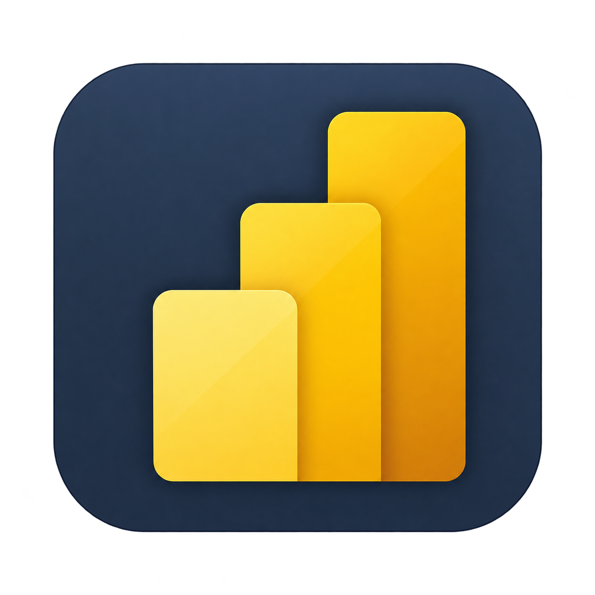
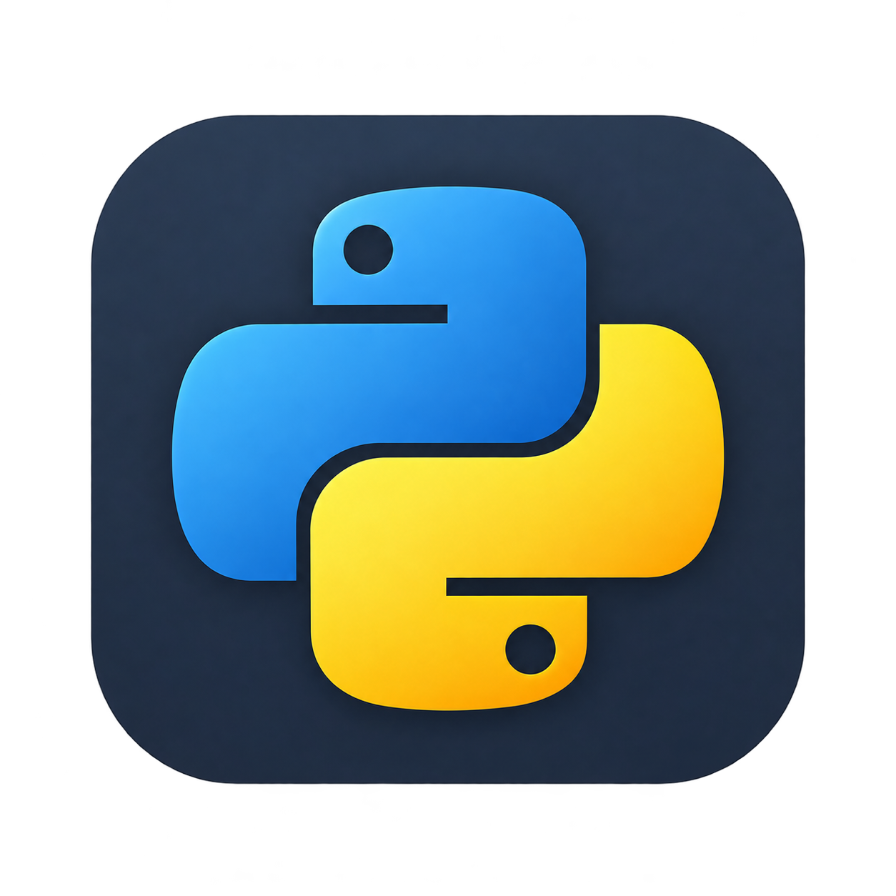
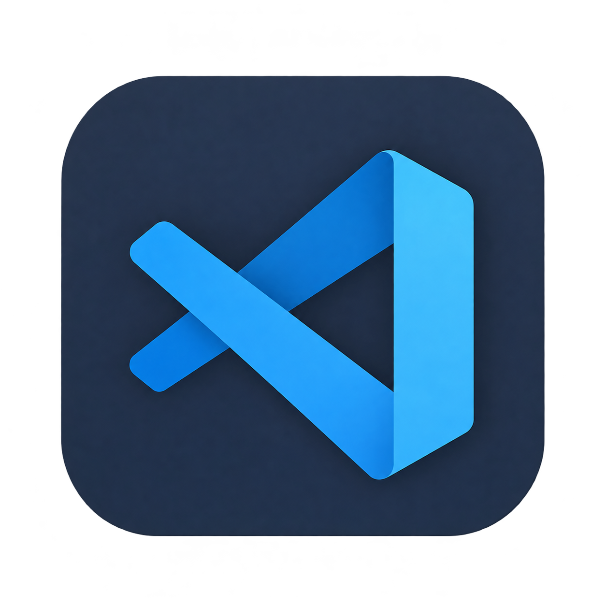
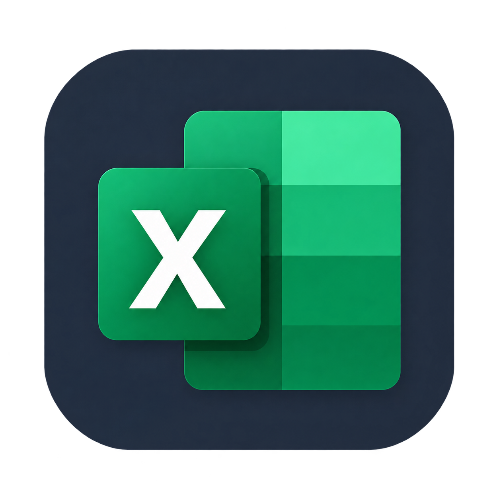
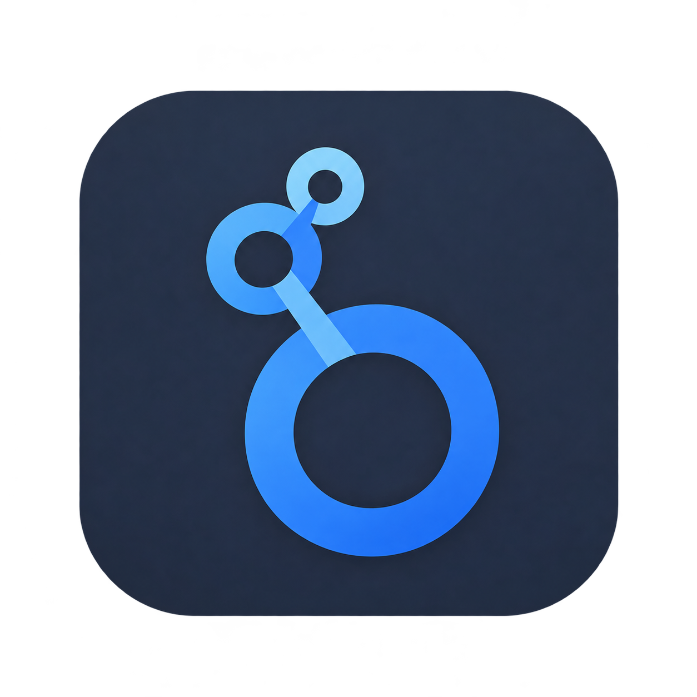
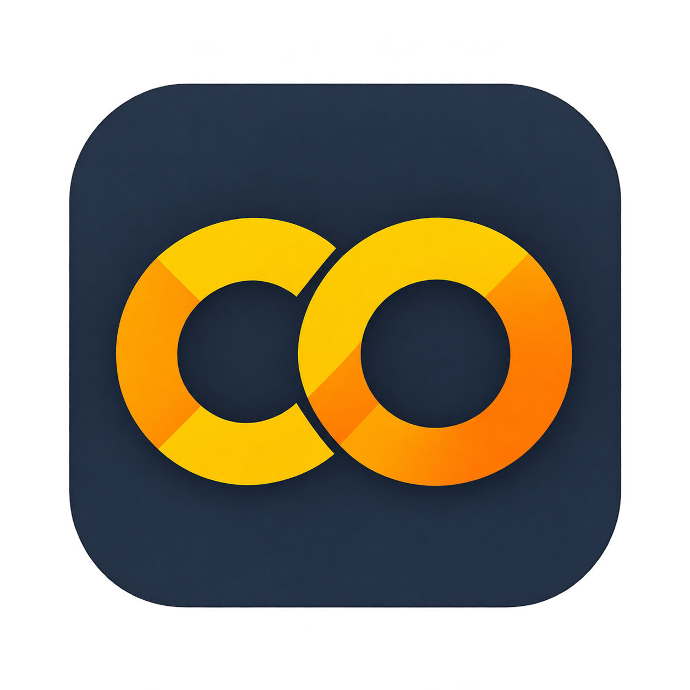

# 👋 Hi, I'm Florencia

### Data Analyst | Data Science | Business Intelligence

I transform data into insights through analytics, visualization and machine learning.

---

## 🛠️ Languages & Tools

<!-- Acá vamos a colocar los íconos/badges -->

  
  
  
  
  
  
  
  
  

---

## 🧠 Data Science

### 🏠 Airbnb — Data Science

Brief description of the project and the main objective.

**Tools:** Python · Pandas · Scikit-learn · Machine Learning

[View project →](#)

### 🤖 Project 02 — Machine Learning

Brief description of the project and the main objective.

**Tools:** Python · Machine Learning · Scikit-learn

[View project →](#)

### 🧠 Project 03 — NLP

Brief description of the project and the main objective.

**Tools:** Python · NLP · Pandas · Machine Learning

[View project →](#)

---

## 📊 Data Analytics

### 📈 Project 01 — Customer Experience Analytics

Brief description of the project and the main insights.

**Tools:** Power BI · SQL · Excel

[View project →](#)

### 📊 Project 02 — Digital Campaign Performance

Brief description of the project and the main insights.

**Tools:** Power BI · Excel · Data Visualization

[View project →](#)

### 📉 Project 03 — Business Analytics

Brief description of the project and the main insights.

**Tools:** SQL · Power BI · Data Analysis

[View project →](#)

---

## 📫 Let's Connect

[LinkedIn](#) · [GitHub](#) · [Email](#)
