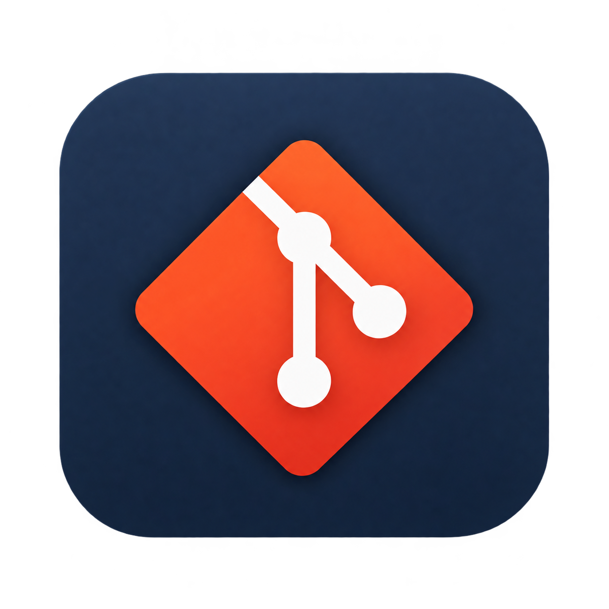
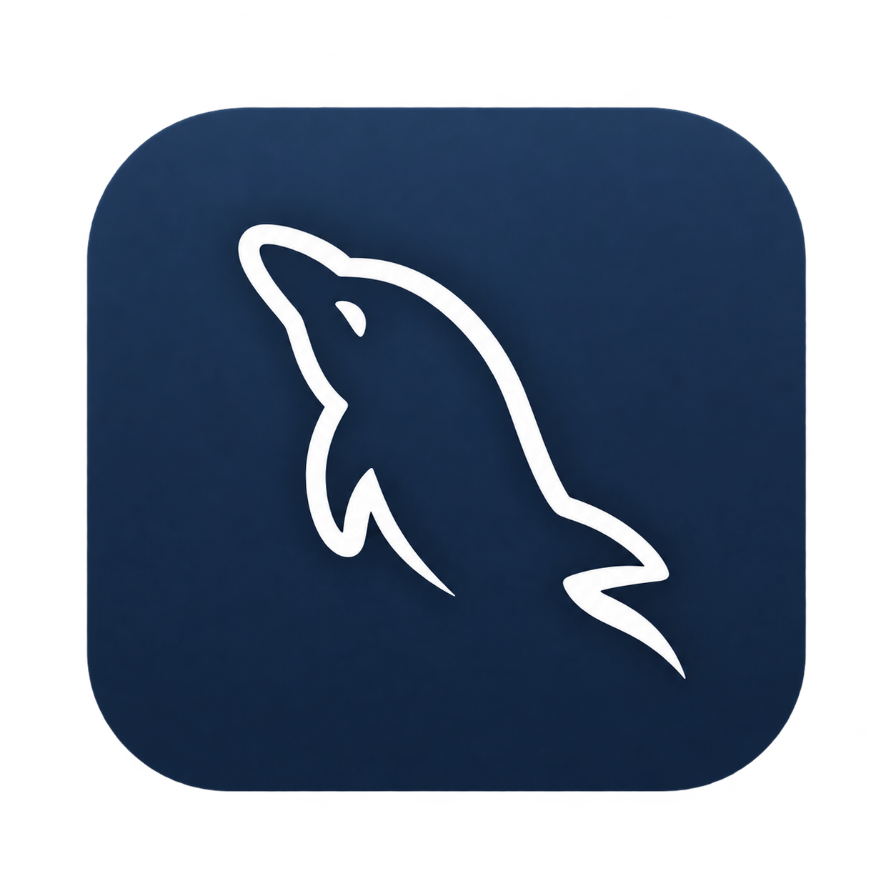
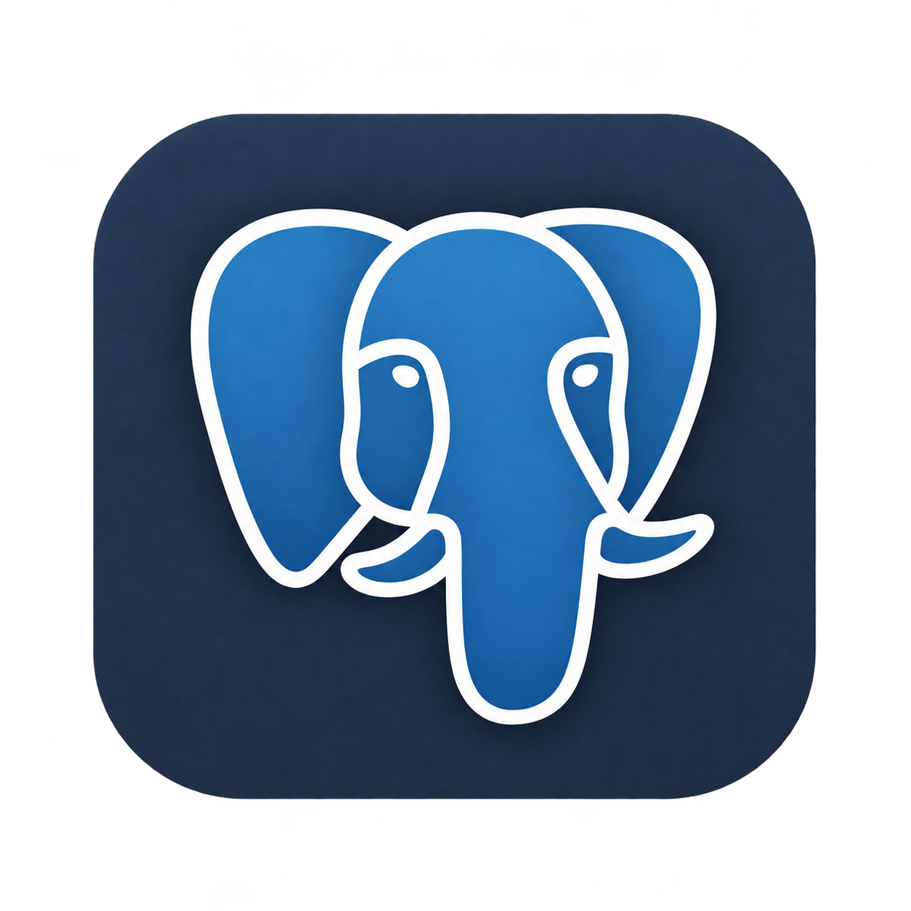
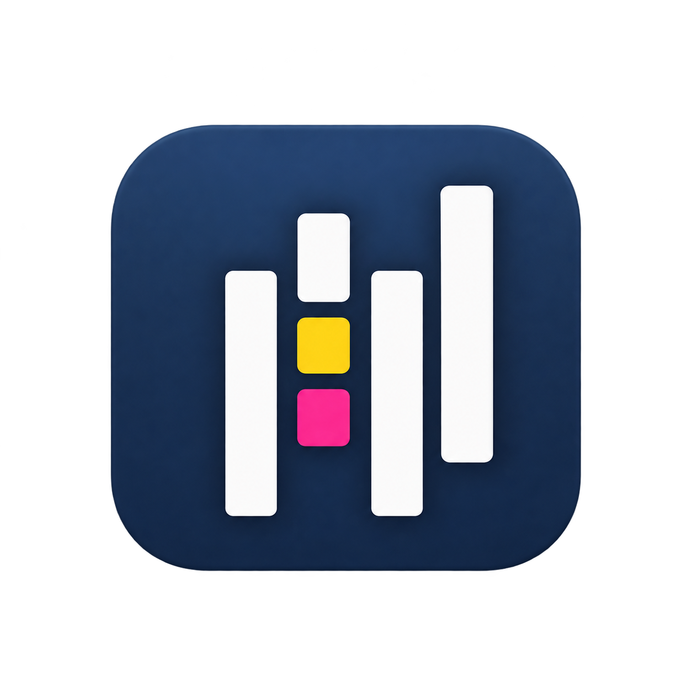
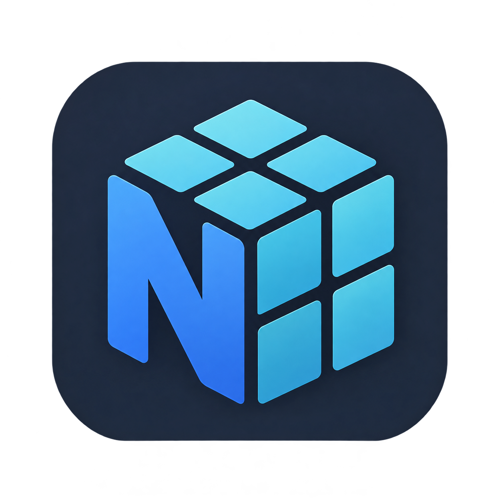
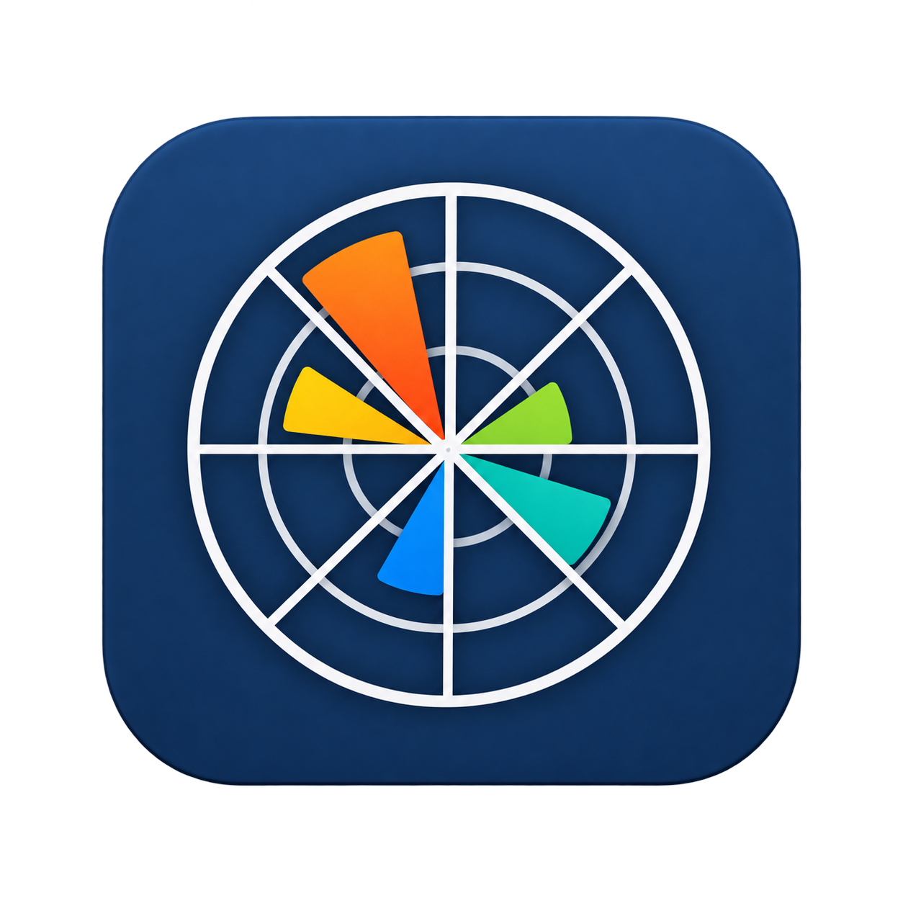

# 👋 Hi, I'm Florencia

### Data Analyst | Data Science | Business Intelligence

I transform data into insights through analytics, visualization and machine learning.

---

## 🛠️ Languages & Tools

<!-- Acá vamos a colocar los íconos/badges -->

  
  
  
  
  
  
  
  
   
  
  
  

---

## 🧠 Data Science

### 🏠 Airbnb — Data Science

Data Science aplicada al análisis del mercado de Airbnb en Buenos Aires, integrando EDA, series temporales, NLP y Machine Learning para analizar rentabilidad, riesgos operativos y experiencia del cliente.

**Tools:** Python · Pandas · Scikit-learn · NLP · Machine Learning · Power BI

[View project →](https://github.com/flora-91/DATA-SCIENCE-Airbnb-Analytics)

### 🤖 Customer Churn  — Predictive mnodeling

Análisis y predicción de Customer Churn mediante Machine Learning supervisado y técnicas de clustering para identificar los factores asociados al abandono y segmentar clientes según sus patrones de comportamiento.

**Tools:** Python · Pandas · Scikit-learn · Machine Learning · Clustering

[View project →](https://github.com/flora-91/DATA-SCIENCE-Churn-Prediction)

### 📊 Customer Experience Analytics

Solución end-to-end que integra datos operativos, NPS, CSAT y comentarios de clientes mediante ETL, NLP y Machine Learning para analizar la experiencia y predecir clientes detractores.

**Tools:** Python · PostgreSQL · Snowflake · NLP · Machine Learning · Power BI

[View project →](https://github.com/flora-91/DATA-SCIENCE-Customer-Experience-Analytics)

---

## 📊 Data Analytics

### 📈 Project 01 — Customer Experience Analytics

Brief description of the project and the main insights.

**Tools:** Power BI · SQL · Excel

[View project →](#)

### 📊 Project 02 — Digital Campaign Performance

Brief description of the project and the main insights.

**Tools:** Power BI · Excel · Data Visualization

[View project →](#)

### 📉 Project 03 — Business Analytics

Brief description of the project and the main insights.

**Tools:** SQL · Power BI · Data Analysis

[View project →](#)

---

## 📫 Let's Connect

[LinkedIn](#) · [GitHub](#) · [Email](#)
